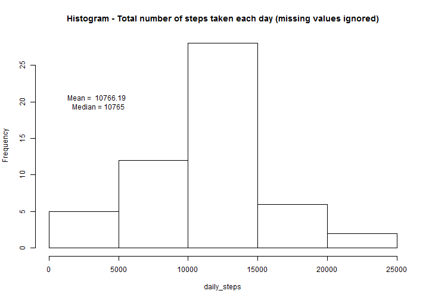
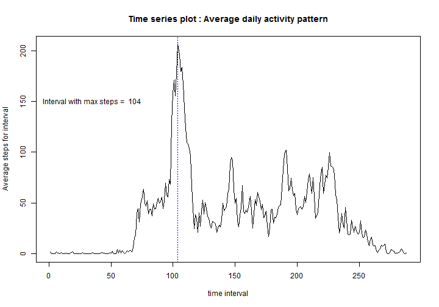
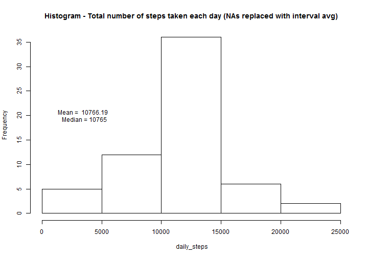

This is an R Markdown document for Project 1 of Course: Reproducible Research.


```r
        # Read data and pre-process
            fname = "activity.csv"
            data <- read.csv(fname)
            data1 <- na.omit(data) # remove all rows with NA values
```

### Code : Question 1 of assignment


```r
# ========== QUESTION : What is mean total number of steps taken per day (ignore missing values ) ======= #
        
        # Calculate - daily steps taken, mean and median of "daily steps"
            daily_steps <- tapply(data1$steps, as.Date( data1$date, format = "%Y-%m-%d"), sum)
            mean_daily_steps <- mean(daily_steps)
            cat( " Mean of daily steps (missing values ignored) = ", mean_daily_steps )
```

```
##  Mean of daily steps (missing values ignored) =  10766.19
```

```r
            median_daily_steps <- median(daily_steps)
            cat( " Median of daily steps (missing values ignored) = ", median_daily_steps )
```

```
##  Median of daily steps (missing values ignored) =  10765
```

```r
        # Or use dplyr package
            # install.packages("dplyr"); library(dplyr)
            # daily_data <- { data %>% filter(!is.na(steps) ) %>% 
            # group_by(date) %>% summarize( sum_counts=sum(steps) ) }
            # hist(daily_data$sum_counts)
        
        
        # Make plot - Histogram of daily steps
            hist(daily_steps, main = "Histogram - Total number of steps taken each day (missing values ignored)")
```

 


### Code : Question 2 of assignment


```r
# ========== QUESTION : What is average daily activity pattern (missing values ignored) ================ #
        
        # Calculate - average daily activity pattern
            interval_steps_avg <- tapply(data1$steps, data1$interval, mean)
            interval_sum <- lapply(data1$interval, sum) # output is a list
            interval_of_max <- which.max(interval_steps_avg)
        # Print values
            cat( " Interval which contains maximum number of steps = ", interval_of_max )
```

```
##  Interval which contains maximum number of steps =  104
```

```r
            cat( " Time value of interval (minutes) = ", unlist( interval_sum[interval_of_max] ) ) #unlist for cat
```

```
##  Time value of interval (minutes) =  835
```

```r
            cat( " Maximum number of steps in interval = ", interval_steps_avg[interval_of_max] )
```

```
##  Maximum number of steps in interval =  206.1698
```

```r
            plot(interval_steps_avg, type="l", xlab = "time interval", ylab = "Average steps for interval",
                 main = "Average daily activity pattern")
```

 


### Code : Question 3 of assignment


```r
# ========== QUESTION : Impute missing values - What is effect on total steps/day ====================== #
        
        # Count and print number of missing values
            na_count <- table( data$steps, useNA="ifany")
            cat( " Number of rows in the data set with NA values = ", tail(na_count, n=1) )
```

```
##  Number of rows in the data set with NA values =  2304
```

```r
        # Replacing NA values
        
            # Prepare intervals steps avg frame
            
            ints_avg <- data.frame(interval_steps_avg, row.names=NULL)
            ints <- data.frame( data[1:288,3] ) # extract a colummn with time intervals
            isa <- cbind(ints, ints_avg)
            colnames(isa) <- c("interval", "steps_avg")
        
            # develop a column with NA's replaced
            
            data2 <- data.frame( ifelse( is.na(data$steps), 
                                      isa[ match( data$interval,isa$interval ), 2 ]    , 
                                      data$steps) )
        
            colnames(data2) <- "replaced_steps"
        
            # re-assign column to dataset
            data3 <- data; data3$steps <- data2$replaced_steps
        
        # Calculate - daily steps taken, mean and median of "daily steps"
            
            daily_steps_noNA <- tapply(data3$steps, as.Date( data3$date, format = "%Y-%m-%d"), sum)
            mean_daily_steps_noNA <- mean(daily_steps_noNA) 
            cat( " Mean of daily steps (NAs replaced with interval avg ) = ", mean_daily_steps_noNA )
```

```
##  Mean of daily steps (NAs replaced with interval avg ) =  10766.19
```

```r
            median_daily_steps_noNA <- median(daily_steps)
            cat( " Median of daily steps (NAs replaced with interval avg) = ", median_daily_steps_noNA )
```

```
##  Median of daily steps (NAs replaced with interval avg) =  10765
```

```r
            cat( " What is impact ? compared to ignoring NAs ? = ", " Results identical i.e. no impact" )
```

```
##  What is impact ? compared to ignoring NAs ? =   Results identical i.e. no impact
```

```r
        # Make plot - Histogram of daily steps
            hist(daily_steps_noNA, xlab=" daily_steps", 
                 main = "Histogram - Total number of steps taken each day (NAs replaced with interval avg)")
```

 


### Code : Question 4 of assignment


```r
# ========== QUESTION : Are there differences in activty patterns between weekdays and weekends ? ======= #
        
        # create a column of factor variable which identifies weekday and weekend
        
            data_days <- weekdays(as.Date(data3$date, format = "%Y-%m-%d"), abbreviate=FALSE)
            dd <- data_days
            data_days <- data.frame(data_days); colnames(data_days) <- "day"
            check_days <- c("Monday", "Tuesday", "Wednesday", "Thursday", "Friday")
        
            # differentiate weekday vs weekend
        
            dd[dd=="Monday"] <- "weekday"
            dd[dd=="Tuesday"] <- "weekday"
            dd[dd=="Wednesday"] <- "weekday"
            dd[dd=="Thursday"] <- "weekday"
            dd[dd=="Friday"] <- "weekday"
            dd[dd=="Saturday"] <- "weekend"
            dd[dd=="Sunday"] <- "weekend"
            dd <- data.frame(dd); colnames(dd) <- "day_status"
        
        # Make new data set with day_status column
            data3_new <- cbind(data3, data_days, dd)
        
        # Average data for each time interval: for weekdays and weekends separately: Note "dplyr" installed in R
            library(dplyr)
            data4 <- data.frame( { data3_new %>% 
                                   group_by(day_status, interval) %>% 
                                   summarize( avg_steps=mean(steps))} )
        
        # Make a Panel plot
            library(lattice)
        
        # this uses averaged step data for each interval
            xyplot( avg_steps ~ interval| day_status, data=data4,  layout=c(1,2), type="l", 
                    ylab = " Average steps", main = "Activity patterns - weekend vs weekday")
```

 

```r
        # this uses steps data without averaging 
        #    xyplot( steps ~ interval| day_status, data=data3_new,  layout=c(1,2), type="l",
        #        main = "Activity patterns - weekend vs weekday")
```
